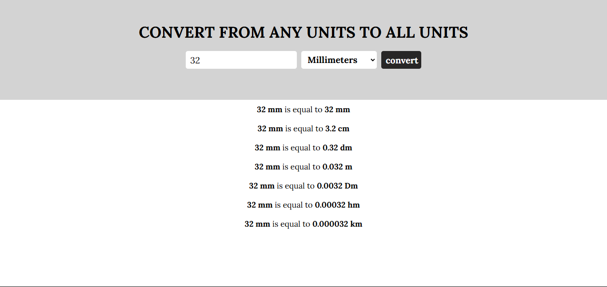

<h1 align=center> Unit Converter</h1>

A **Unit Converter** is a web-based tool that allows users to convert values between various basic units, including **millimeters (mm)**, **centimeters (cm)**, **decimeters (dm)**, **meters (m)**, **dekameters (Dm)**, **hectometers (hm)**, and **kilometers (km)**. This project is built using **HTML**, **CSS**, and **JavaScript**, and it provides a simple, intuitive interface for quick and accurate unit conversions.

---

## Features
- **Convert Between Multiple Units**: Supports conversions between 7 metric units.
- **Real-Time Results**: Instantly displays converted values for all units.
- **Error Handling**: Validates user input and displays error messages if required fields are missing.
- **Responsive Design**: Works seamlessly on desktop, tablet, and mobile devices.
- **Clean UI**: Simple and user-friendly interface.

---

## How It Works
The Unit Converter works by taking a user-provided value and a selected base unit (e.g., millimeters, centimeters, etc.). When the user clicks the **"Convert"** button, the JavaScript code calculates the equivalent value in all other supported units and displays the results in a clean, formatted layout.

### Example:
- **Input**: `10 meters`
- **Output**:
  - `10 meters is equal to 10000 mm`
  - `10 meters is equal to 1000 cm`
  - `10 meters is equal to 100 dm`
  - `10 meters is equal to 1 Dm`
  - `10 meters is equal to 0.1 hm`
  - `10 meters is equal to 0.01 km`
## Contributing
Contributions are welcome!
